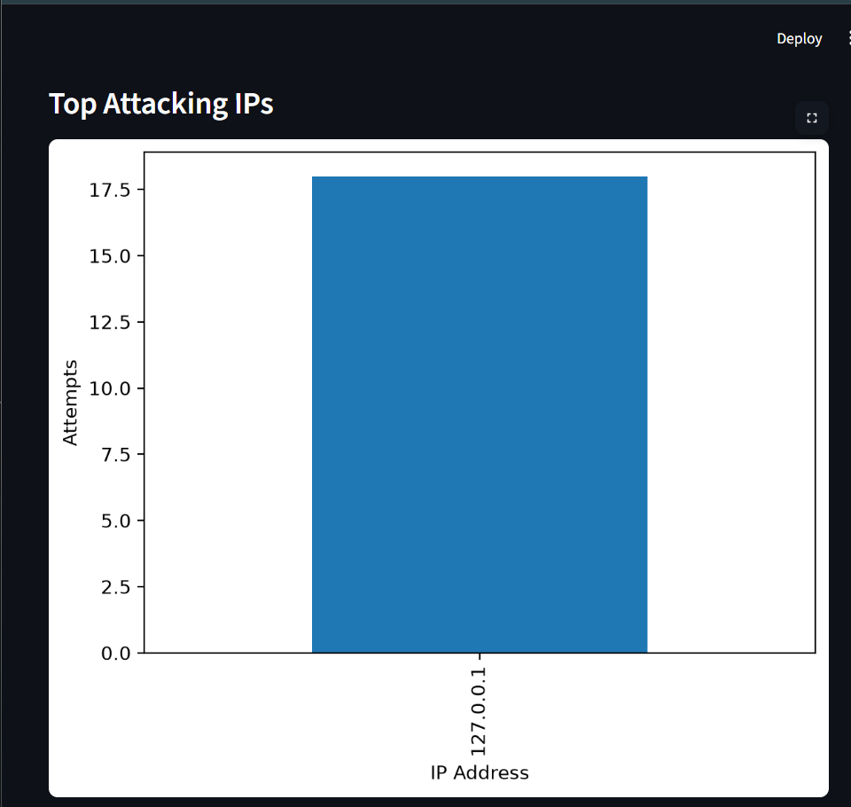
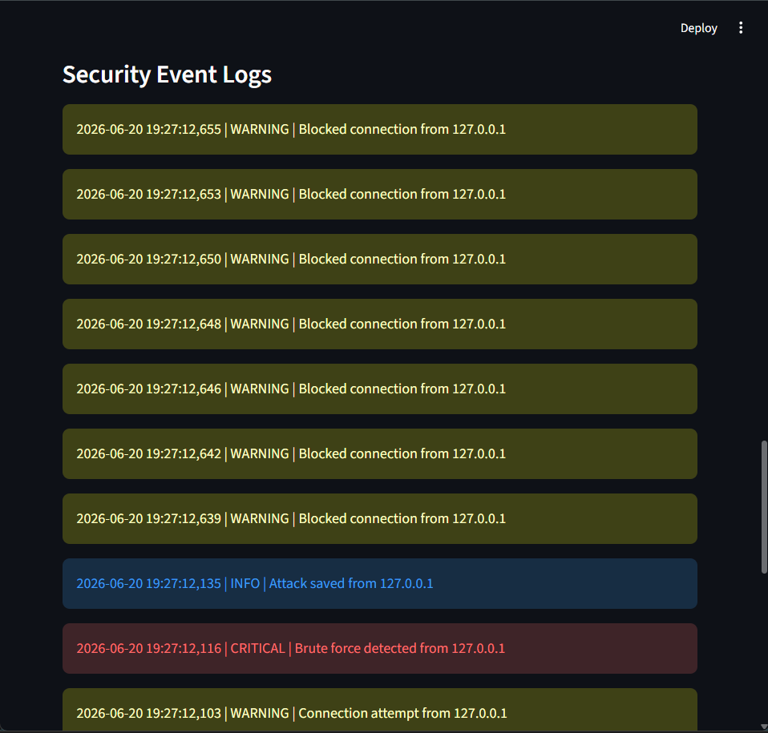
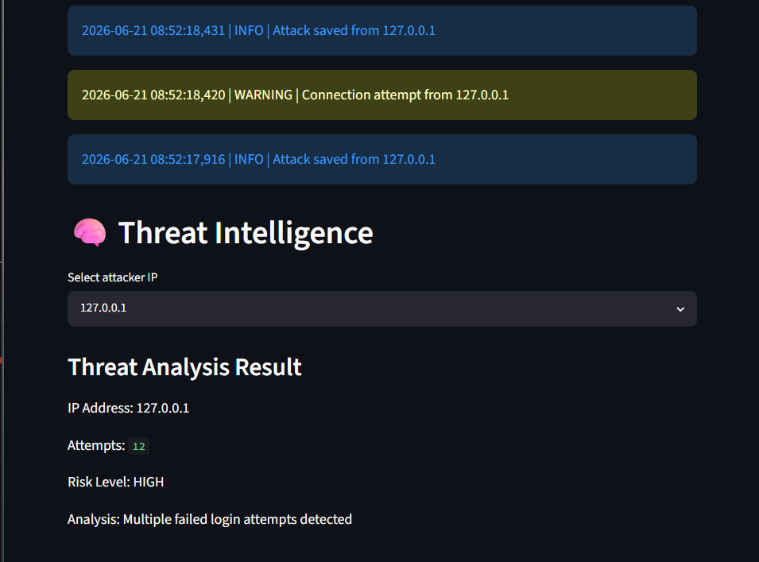
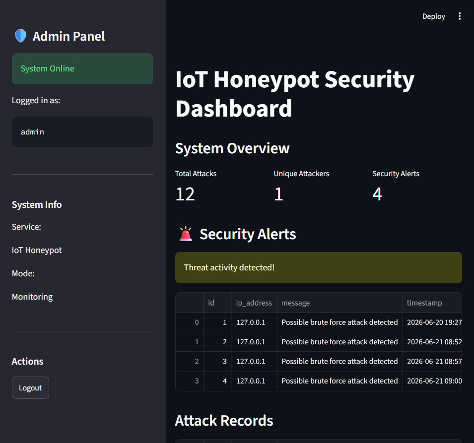

# IoT Honeypot Security System 🛡️

A cybersecurity project that simulates an IoT device honeypot to capture, analyze, and monitor unauthorized access attempts.


## Overview

IoT devices are common targets for attackers due to weak credentials and exposed services.

This project creates a fake IoT Telnet environment that attracts attackers, records their activity, detects suspicious behavior, and provides security insights through a monitoring dashboard.


## Features

### Honeypot Engine

- Fake IoT Telnet device simulation
- Credential capture
- Attack logging
- Input sanitization


### Detection System

- Brute force detection
- Persistent security alerts
- Automatic attacker IP blocking
- Threat intelligence risk scoring


### Security Dashboard

- Attack monitoring
- Data visualization
- Security alerts
- Blocked IP management
- Security event logs
- Authentication protection


### Reporting

- CSV attack reports
- SOC-style incident reports


### Security Improvements

- Environment based configuration
- Password hashing
- Secure admin authentication
- Automated system testing


## Architecture


```
                Attacker

                    |

                    v

          Fake IoT Device Service

                    |

                    v

            Honeypot Engine


        -----------------------

        |          |          |

        v          v          v


   Database    Detection    Logs


        |          |          |

        -----------------------

                    |

                    v

          Security Dashboard

                    |

        -----------------

        |               |

   Reports       Threat Intel
```


## Project Structure


```
IoT-Honeypot

├── dashboard
│   └── app.py

├── honeypot
│   ├── server.py
│   ├── detector.py
│   ├── database.py
│   ├── auth.py
│   ├── threat_intel.py
│   └── report.py

├── tests

├── reports

├── screenshots

├── docs

└── README.md
```


## Installation


Clone repository:


```bash
git clone <repository-url>

cd IoT-Honeypot
```


Install dependencies:


```bash
pip install -r requirements.txt
```


## Running Honeypot


```bash
python honeypot/main.py
```


## Running Dashboard


```bash
python -m streamlit run dashboard/app.py
```


## Running Tests


```bash
python tests/system_tests.py
```


Expected:


```
Tests Passed: 3 / 3
```


## Screenshots

### Dashboard Overview


### Attack Analysis



### Security Logs



### Threat Intelligence



### Secure Authentication



## Security Concepts Implemented

- Honeypot Technology
- Network Security Monitoring
- Brute Force Detection
- Incident Response
- Threat Intelligence
- Secure Authentication
- Password Hashing
- Security Logging


## Future Enhancements

- Role Based Access Control (RBAC)
- Email Alert System
- Docker Deployment
- Cloud Deployment
- Machine Learning Based Detection


## Disclaimer

This project is created for cybersecurity learning and defensive research purposes only.