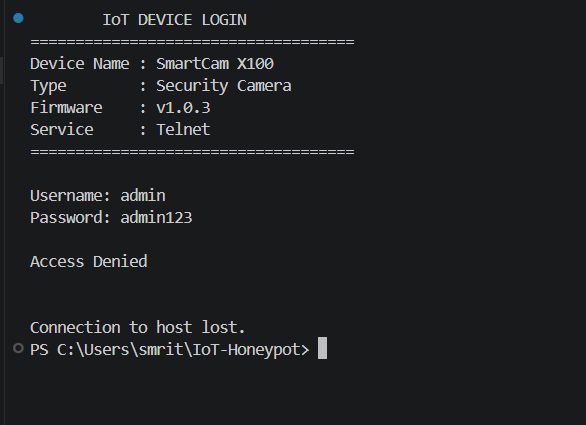
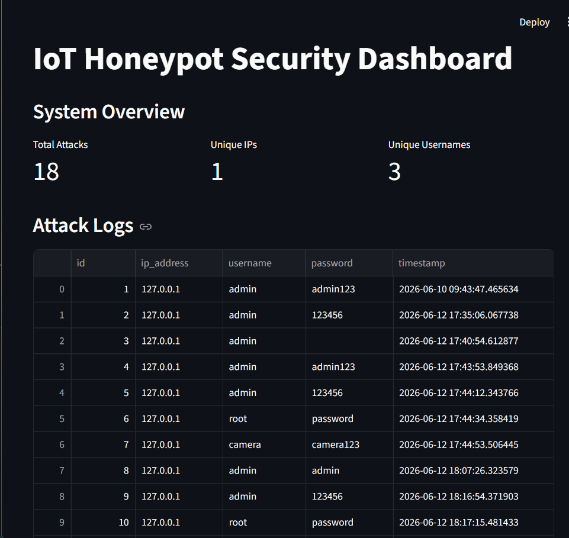
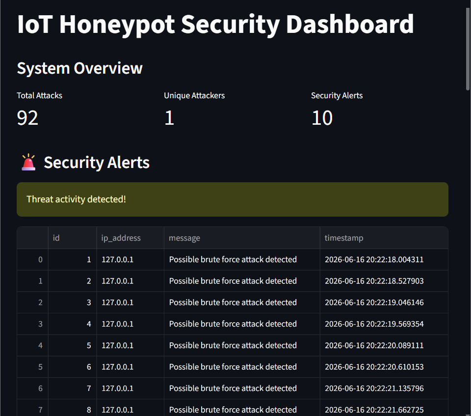
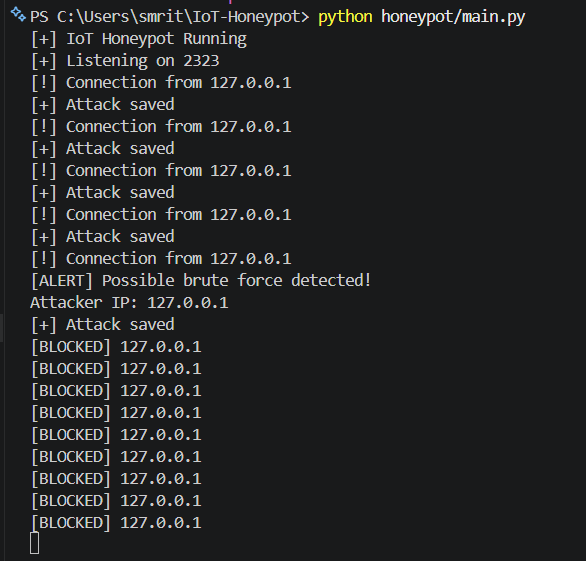

# IoT Honeypot for Attack Detection

A cybersecurity project that simulates a vulnerable IoT device to detect, capture, analyze, and report attacker activity.

## Features

- Fake IoT camera simulation
- Telnet-based honeypot service
- Attacker credential capture
- Attack logging system
- SQLite database storage
- Brute force detection
- Security alert generation
- Attack analytics dashboard
- Graph based visualization
- CSV security report generation

## Screenshots

### IoT Device Simulation

### Security Monitoring Dashboard

### Brute Force Alert Detection

### Automated IP Blocking

## Architecture

Attacker
    |
    v

Fake IoT Device
    |
    v

Honeypot Engine
    |
    +--> Logs
    |
    +--> SQLite Database
    |
    +--> Detection Engine
    |
    +--> Alerts
            |
            v

Security Dashboard + Reports

## Technology Stack

- Python
- Socket Programming
- SQLite
- Streamlit
- Pandas
- Matplotlib
- Git/GitHub

## Project Modules

### Honeypot Server

Simulates an IoT device and captures unauthorized login attempts.

### Detection Engine

Analyzes repeated login attempts and identifies brute force activity.

### Database

Stores:

- Attacker IP address
- Username attempts
- Password attempts
- Timestamp
- Security alerts

### Dashboard

Provides:

- Attack statistics
- Top usernames
- Top passwords
- Attacker monitoring
- Alert visibility
- Report download

## Purpose

This project demonstrates how honeypots can be used in cybersecurity for:

- Threat intelligence
- Attack monitoring
- Credential analysis
- Security research

## Status

Implemented:

✔ IoT Device Simulation  
✔ Attack Capture  
✔ Database Storage  
✔ Brute Force Detection  
✔ Security Alerts  
✔ Dashboard Monitoring  
✔ Report Generation